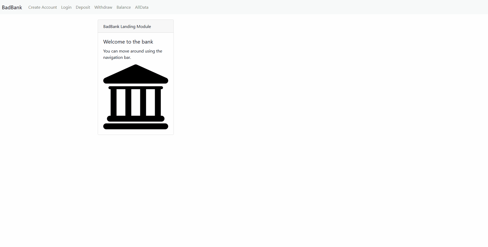

# Bad Bank

# Description:
The Bad Bank is a project that makes use of the front end, an API, and a database.  I created this project for my MIT course, it helped me understand how a larger scale platform functions.

# Installation
To install Bad Bank properly, first click the fork button to get the id of the repo.  Then create a directory for Bad Bank to be installed into.  Move into the directory with command prompt, or another terminal, and run `git clone "Repo ID from clipboard"`.  Once the files are installed, run `npm install` in the terminal that is still in the directory.  For the next step, make sure to have Docker Desktop, Node, and MongoDB installed.  When you are sure they are installed, run `docker run -p 27017:27017 --name badbank -d mongo` in the terminal.  Followed by `node index.js`.  You can now access the website on localhost:3000.

</img>

# Technology Used
I used Docker Desktop, MongoDB, and Node in order to get my project running.

# Features
The project currently allows the user to create accounts with a Name, Email, and Password.  This is then stored in the Mongo database, so refreshing the page does not delete information.  There are currently some bugs within the program, but they will be fixed and this document updated as well.

# License
ISC, MIT